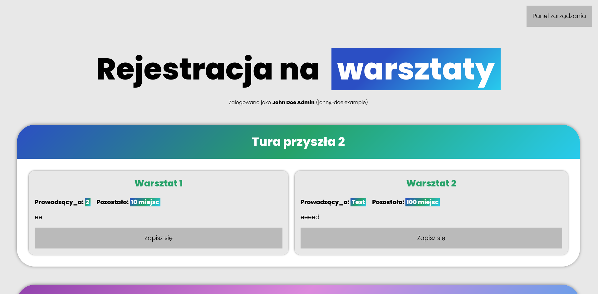

# mySimpleWorkshops
[](https://choosealicense.com/licenses/mit/)

`mySimpleWorkshops` - simple site for courses registration created for II LO in Gorzów Wielkopolski (Poland).



## Installation
1. Download repository:
```bash
git clone https://github.com/jstpp/mysimpleworkshops.git && cd mysimpleworkshops
```
2. Adjust configuration located in `include/config.php`. It would be **necessary to enable Microsoft login**.

> [!tip]
> To enable usage of Microsoft Graph (method of authentication) You need to register your app in proper Microsoft platform. More informations [here](https://learn.microsoft.com/en-us/graph/auth-register-app-v2).

> [!caution]
> Don't share generated microsoft app credentials with others!

3. Start docker compose:
```bash
docker compose -f compose.yaml up
```

4. That's all. You can enjoy your mySimpleWorkshops instance after entering `localhost:80`.


## Usage & tips

> [!tip]
> If You adjusted your config correctly, using admin account You can see special button on the top-right corner of the screen. Use it to enter the management mode.

- Enter the settings to add your first round - after that, You can add new courses to your database. To remove round, You need to remove all courses in mentioned round.
- Amount of available seats can be increased by changing max. amount of seats.
- You can sign in only for one course registered in specified round. Create multiple rounds to allow users to register for multiple courses.
- If You need admin permissions without adjusting the config file, You can modify this code by using `test_admin()` function in proper line/file/function.

If You need some help, feel free to message me: jstpp@int.pl

> [!warning]
> Remember to test this app before running it for your events.

## Translation & contribution
Although the code variables and comments are in English, this app doesn't provide English GUI. Feel free to add translations and propose code changes.